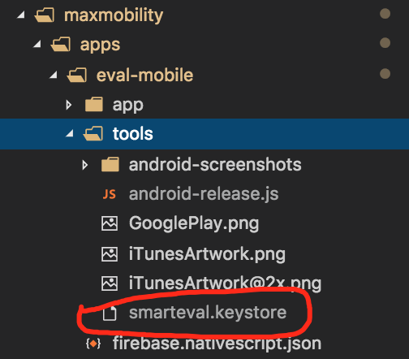

# Max-Mobility

### Project Structure

The project structure follows the [Nx workspace](https://nrwl.io/nx/guide-nx-workspace#create-a-new-nx-workspace) approach with the added `xplat` directory for platform specific code for various environments: mobile, web, desktop, etc.

### Running the Smart Evaluation mobile app

Execute - `cd maxmobility && npm run start.eval.mobile.android`

- _This should path down to the `apps/eval-mobile` dir and exec the `tns run android` cmd to start the mobile app._

### Creating release builds for Smart Evaluation (eval-mobile)

#### Android

Important: you need the .keystore file, this is kept internally. Without it, you cannot create a signed release build.
For the build to work successfully, the script will look for the keystore in the `maxmobility/apps/eval-mobile/tools/` directory. Image below shows where it should be for the script to work properly.

- Execute `npm run android-release $KEYSTORE_PASSWORD` - replace $KEYSTORE_PASSWORD with the actual password for the keystore for eval-mobile). If you do not provide the password argument in the command, you'll be prompted for it.

#### iOS

- Execute `npm run ios-release` - this will create a release build for iOS.
- Open the .xcworkspace file in xcode, the file is located in `maxmobility/apps/eval-mobile/platforms/ios`
- Make sure the build # has been incremented or the upload will fail if it's already used.
- Create an archive and then upload to iTunesConnect.

- You can try publishing to iOS from the command line but you'll need your apple dev account username and password to execute the `tns publish ios` command. In the past, this has been spotty, so the manual upload through XCode has been more reliable.
